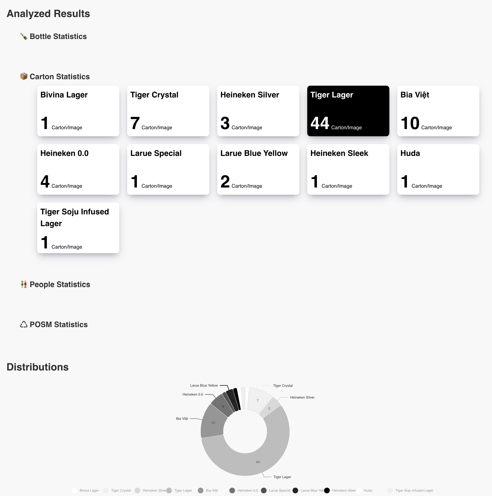
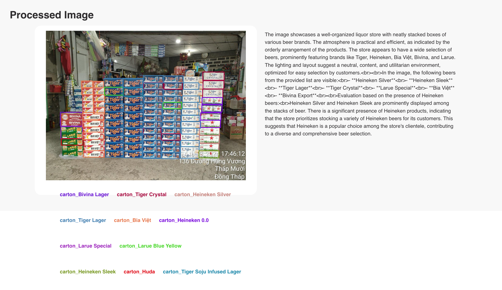

# 🍻 beerlover-hackhcmc at Digital Empowerment Track @ AngelHack HCMC '24

## Objective
Creating a website where all the information, after being analyzed, will be visualized in the form of a dashboard to help visualize the user experience.

## Key Features
- Count the number of 🍾 Cans/Bottles, 📦 Cartons, 👫 People and ♺ POSM; then transform them into distributions as Pie Chart

- Also detect information about Activities and Locations, Atmosphere, Emotion 

- Then all of the information, after being processed (drawing bbox, write report,...) will be shown in the end of the website

## Technology:
Core techniques:
- SOTA Prompting Engineering technique: Graph of Thoughts, Chain of Thoughts.

- Details classification using retrieval system: FAISS Vector Space with embedding from SOTA Image Retrieval models (Google/SigLIP, Meta/Dino, Microsoft/BEiT3)  Enhance Accuracy, Scalability comparing to “OCR or using YOLO only” method.

- Training YOLOv10 for classify (`Can`, `Carton`, `Beer POSM`) without depending on the organizer’s training datasets.

## Technical Skill
- Python: `Pytorch`, `Hugging Face`, `NumPy`, `FAISS`, `FastAPI`, etc.
- Website: `ReactJS`, `HTML`, `CSS`, `Figma`, etc.
